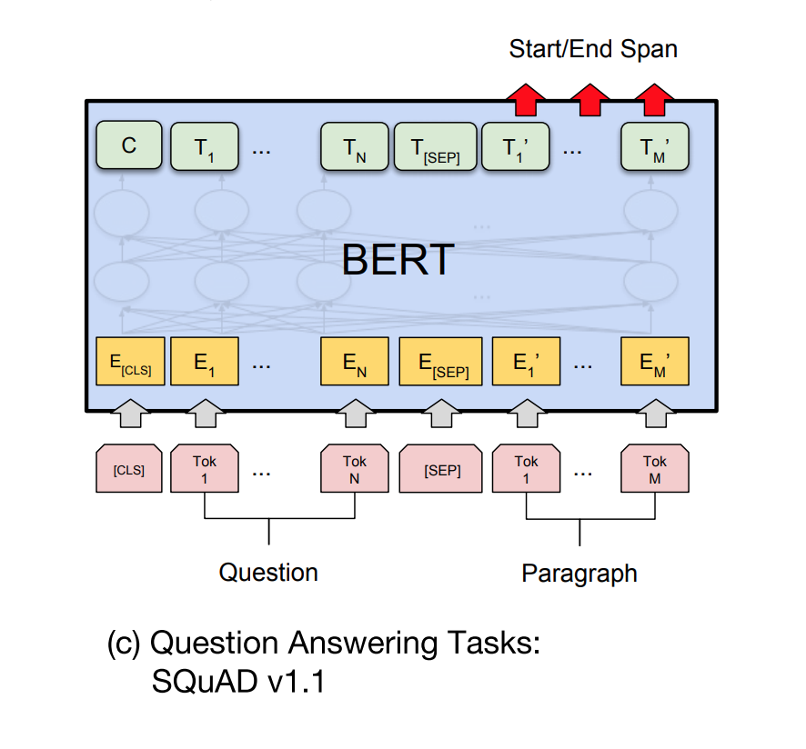
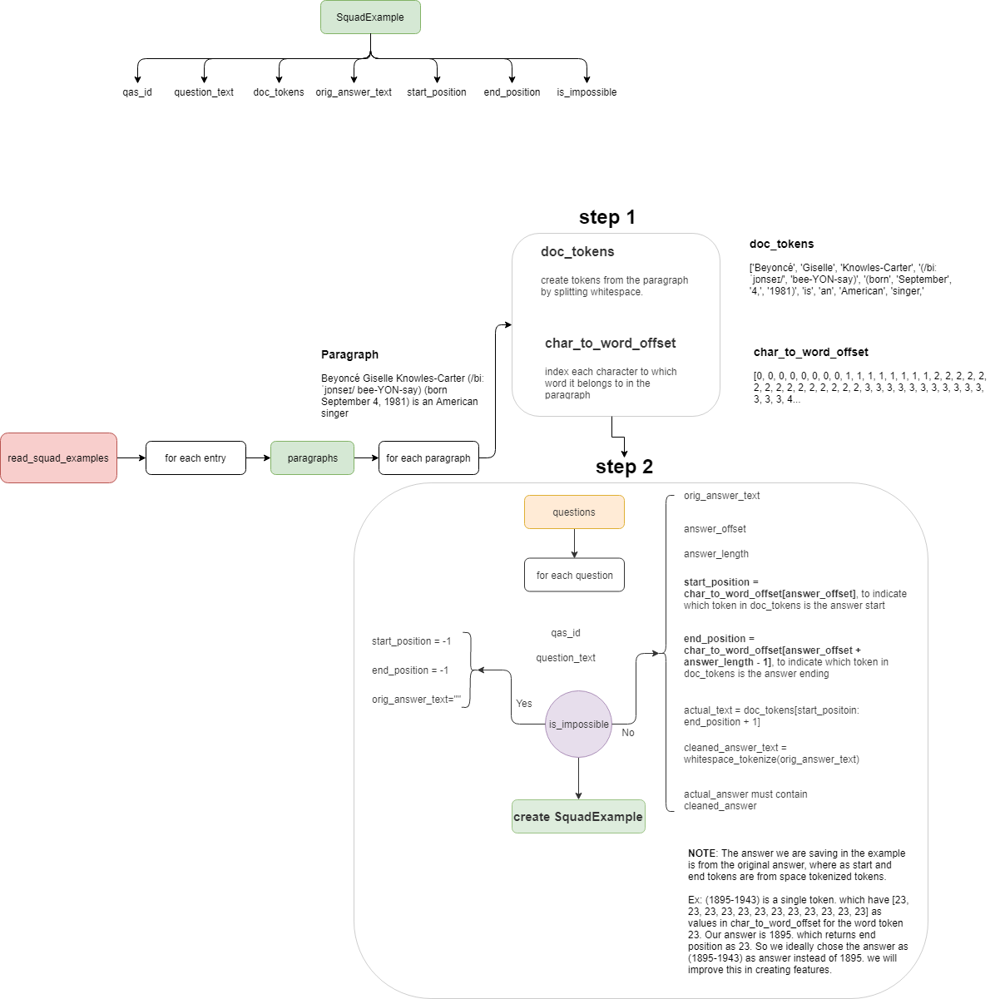
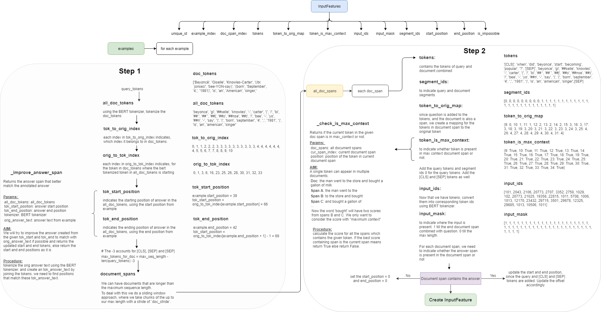
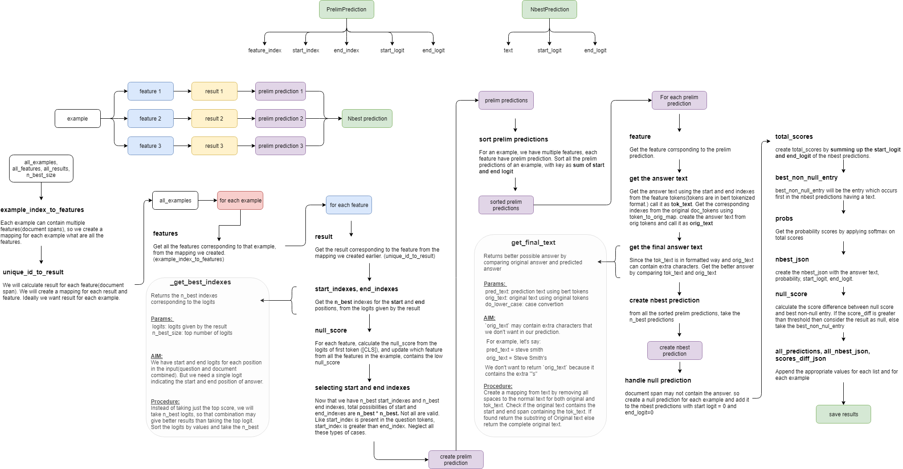

# Machine Comprehension
Machine(reading) comprehension using SQuAD dataset

I will be using BERT model for QuestionAnswering.

I have taken the code from this [repo](https://github.com/huggingface/pytorch-pretrained-BERT)

## Overivew

This repository comprises implementation of Question Answering using the pretrained BERT model.

- [What is BERT?](#what-is-bert)
- [BERT for Question Answering](#bert-for-question-answering)
- [What is SQuAD?](#what-is-squad)
- [Reading the SQuAD data](#reading-the-squad-data)
- [Converting into features](#converting-into-features)
- [Training](#training)
- [Evaluation](#evaluation)
- [Next Steps](#next-steps)

### What is BERT?

BERT, or Bidirectional Encoder Representations from Transformers, is a new method of pre-training language representations which obtains state-of-the-art results on a wide array of Natural Language Processing (NLP) tasks.

You can read more from the following resources: 
- [paper](https://arxiv.org/abs/1810.04805)
- [blog](http://jalammar.github.io/illustrated-bert/)
- [official code repository](https://github.com/google-research/bert#what-is-bert)

Results were all obtained with almost no task-specific neural network architecture design.

### BERT for Question Answering

In the paper, they suggested the architecture for Question Answering Tasks:

Key steps:

- Question is treated as sequence 1 and Paragraph is treated a sequence 2
- Predicition of Start and End positions of the answer are from the Paragraph tokens.
- To get that predicitions, we add a linear layer which takes each token output and output 2 values, indicating the logits for start and end positions.

The above mentioned linear layer on top BERT is already implemented as [`BertForQuestionAnswering`](https://github.com/huggingface/pytorch-pretrained-BERT/blob/master/pytorch_pretrained_bert/modeling.py#L1130)

### What is SQuAD?

Stanford Question Answering Dataset (SQuAD) is a reading comprehension dataset, consisting of questions posed by crowdworkers on a set of Wikipedia articles, where the answer to every question is a segment of text, or span, from the corresponding reading passage, or the question might be unanswerable.

The dataset can be dowloaded from [here](https://rajpurkar.github.io/SQuAD-explorer/)

See a sample squad data [here](./samples/squad_sample.md)

### Reading the SQuAD data

Each data point in Squad has

- A entry: A wikipedia article
- Each entry has multiple paragraphs
- Each paragraph multiple questions
- Each question has a single / no answer

Converting the squad data into `SquadExample` instances are done as the following.

Main steps involved in data reading are :

- for each paragraph
    - creating the tokens for each paragraph
    - creating the character to token offset
    - for each question in the paragraph
        - creating the answer text from the given answer offset positions
        - get the start position of the answer
        - get the end position of the answer
        - create the `SquadExample` using the above data

### Converting into features

Once the data is read, the next step would be to convert the `SquadExample` into `InputFeatures` so that it will suitable for the model to process.

Convertion of examples into features are done as the following.

Main steps involved in convertion of examples into features are :

For each example:

- convert the query into tokens
- convert the document into tokens using BERT tokenizer (WordPiece tokenizer)
- create the mappings from bert tokenized tokens to normal (whitespaced) tokens
- Get the start and end token positions from the bert tokens
    - Update the start and end tokens that better matches the answer
- Create document spans: documents having more than sequence lengths split the document into multiple spans.

For each document span:

- Add the query tokens into `tokens` which contains all the input tokens
- Add the `[CLS]` token and `[SEP]`, which indicates that query is the sequence 1
- Create the segment ids `0` to indicates the question sequence.
- Since the question is added, create the mapping of document tokens to original token
- Check whether the each token in document span is having maximum context
    - Since document spans are created for documents having length greater than maximum sequence length, a token in document can appear in multiple document spans. We want to return better answer. So we check if the token is maximum context document span or not.
- Add the `[SEP]` token at the end of document span tokens
- Add the corresponding segment ids `1` to indicate the document span tokens.
- Pad the tokens and segment ids upto maximum sequence length
- Convert the tokens into ids using the BERT tokenizer
- Create the input mask, indicating upto where the input is present and where the padding is.
- Indicate whether the document span is containing the answer or not by checking the positions.
- Create the `InputFeatures` using the above data.

### Training

There are various types of BERT models available

-   BERT base, uncased
-   BERT base, cased
-   BERT large, uncased
-   BERT large, cased

I choose the BERT base, uncased model for training. 

Once the model is downloaded and the data is converted into features, we can train the model.

Main steps involved in training are:
- Create a sampler for the train data
- Create a dataloader using the sampler and train data
- Create a optimizer for updating the model params
- `CrossEntropyLoss` is the loss used
- The loss function is already implemented in `BertForQuestionAnswering` class.
- Train the model
- Save the trained model, and the configuration used.

### Evaluation

Each datapoint is a example. As discussed already, each example can contain multiple document spans(features). So we need to predict for each feature what are the start and end positions.

Then from all features of an example, we need to select the best possible start and end positions. The initial positions for each feature is returned by the trained model. But we need to select the best positions which will be done via "Post Processing".

Post processing of selecting best possible start and end positions of answer is done as the following.

Main steps involved in post processing are:

Each example contains multiple features. For each feature there will be a result. We need to select the best results from all the results combined.

- Create a mapping for each example to its features
- Create a mapping for each result to feature

For each feature
- Get the corresponding result
- Get the `n_best` indexes for the start and end positions, using the logits returned by the model.
- Account for `no answer` cases.
- Now that there are `n_best` indexes for start position and `n_best` indexes for end position, prune all the invalid cases like:
    - start index is greater than end index
    - start index is not in document tokens
    - end index is not in end tokens
    - start index is not in maximum context
- Create a `prelim prediction` using the above data

Now merge all the prelim predictions of all features of an example.
- sort the prelim predictions

Select the `n_best` predictions from prelim predictions as following:
- Get the start position from the document using the predicted start index (Note that start position from the document might be different, because document contains normal tokens where as the start position predicted is from the bert tokenized input)
- Similarly get the end position from the token
- Create the answer text using from the tokens from the original document, call it as `orig_text`
- Create the answer text using the predicted tokens, and remove the extra characters, call it as `tok_text`
- Get the better possible answer using the `orig_text` and `tok_text`
- Account for no answer cases
- Create the `nbest prediction`

Create the prediction probability score by applying softmax over the sum of start_logit and end_logit.

Return the NbestPredictions.

### Next Steps

- Capture the metrics
- Add the sample outputs in each steps of pre-processing, post-processing
